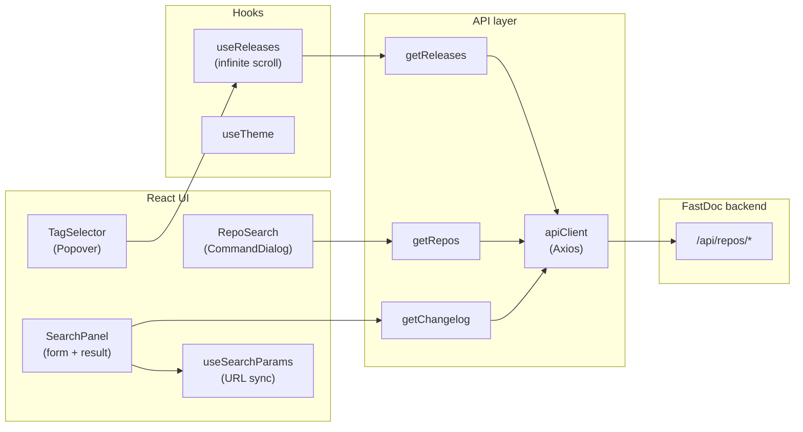
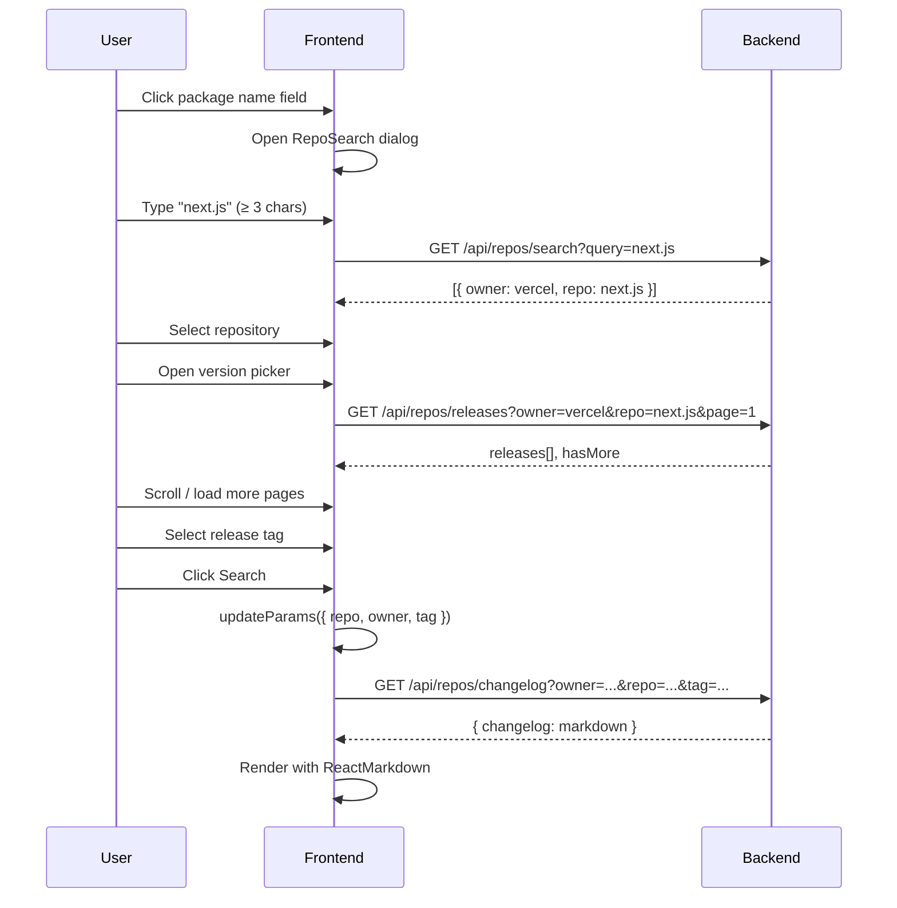

# FastDoc

**FastDoc** is a full-stack application for exploring GitHub release notes. Pick a repository, choose a release tag, and get a clean, structured changelog in Markdown — formatted by an LLM (Groq) on the backend from the raw GitHub Release body.

No more digging through long release pages: search for a project like `next.js`, select a version, and read a concise summary in seconds.

This repository contains the **frontend UI**.

---

## Table of Contents

- [Features](#features)
- [Architecture](#architecture)
- [User Flow](#user-flow)
- [Tech Stack](#tech-stack)
- [Repository Structure](#repository-structure)
- [Environment Variables](#environment-variables)
- [Local Development](#local-development)
- [Build & Production](#build--production)
- [Code Quality](#code-quality)
- [Testing](#testing)
- [CI/CD](#cicd)
- [Limitations](#limitations)
- [Related Repositories](#related-repositories)

---

## Features


| Feature                | Description                                                                                                                  |
| ---------------------- | ---------------------------------------------------------------------------------------------------------------------------- |
| **Repository search**  | Command-palette dialog with debounced GitHub repo search (400 ms, min 3 characters).                                         |
| **Release picker**     | Popover with infinite-scroll release list; stable releases only (filtered on the backend).                                   |
| **Changelog view**     | Renders formatted Markdown with Tailwind Typography (`prose`) styling.                                                       |
| **Shareable URLs**     | Selected `repo`, `owner`, and `tag` are synced to the URL query string for deep linking and browser back/forward navigation. |
| **Dark / light theme** | Toggle with persistence in `localStorage`; inline script in `index.html` prevents flash of wrong theme on load.              |
| **Error toasts**       | API errors surfaced via Sonner with messages from the backend.                                                               |
| **Responsive layout**  | Single-page layout with hero section, search form, and result card.                                                          |


---

## Architecture

The frontend is a React SPA that orchestrates three backend API calls and manages UI state locally. No global state library — data flows through hooks and component state.




**Key design decisions:**

- **URL as source of truth for results** — submitting the search form writes `repo`, `owner`, and `tag` to the query string; a `useEffect` in `SearchPanel` fetches the changelog when all three params are present.
- **Abort on repo search** — consecutive repo search requests cancel the previous in-flight request via `AbortController`.
- **Virtual release selection** — if a tag is present in the URL before releases load, `useReleases` creates a placeholder release object so the picker displays the tag immediately.

---

## User Flow




**Direct linking:** opening a URL like `/?owner=vercel&repo=next.js&tag=v15.0.0` automatically loads the repository, tag, and changelog without user interaction.

---

## Tech Stack


| Category      | Choice                                                                 |
| ------------- | ---------------------------------------------------------------------- |
| Framework     | [React](https://react.dev/) 19                                         |
| Build         | [Vite](https://vite.dev/) 8                                            |
| Language      | TypeScript 6                                                           |
| Styling       | [Tailwind CSS](https://tailwindcss.com/) 4 + `@tailwindcss/typography` |
| UI components | [shadcn/ui](https://ui.shadcn.com/) (Radix Mira style)                 |
| Icons         | [Lucide React](https://lucide.dev/)                                    |
| HTTP          | [Axios](https://axios-http.com/)                                       |
| Markdown      | [react-markdown](https://github.com/remarkjs/react-markdown)           |
| Toasts        | [Sonner](https://sonner.emilkowal.ski/)                                |
| Font          | IBM Plex Sans (variable)                                               |
| Code quality  | ESLint (@antfu/eslint-config), Prettier, `tsc --noEmit`                |
| Tests         | [Vitest](https://vitest.dev/) 4 + Testing Library                      |
| Deployment    | [Cloudflare Pages](https://pages.cloudflare.com/) (via GitLab CI)       |


---

## Repository Structure

```
frontend/
├── public/
│   ├── favicon.svg
│   └── icons.svg
├── src/
│   ├── main.tsx                          # Entry: ThemeProvider + App
│   ├── App.tsx                           # Layout shell, Toaster
│   ├── index.css                         # Tailwind, theme tokens, layout styles
│   ├── pages/
│   │   └── Main.tsx                      # Hero + SearchPanel
│   ├── components/
│   │   ├── Hero.tsx
│   │   ├── layout/header/                # App header, theme toggle
│   │   ├── providers/ThemeProvider.tsx
│   │   ├── searchPanel/
│   │   │   ├── index.tsx                 # Search form, changelog result
│   │   │   ├── repoSearch.tsx            # Repository command dialog
│   │   │   └── tagSelector.tsx           # Release version picker
│   │   └── ui/                           # shadcn/ui primitives
│   ├── api/
│   │   ├── getRepos.ts
│   │   ├── getReleases.ts
│   │   └── getChangelog.ts
│   ├── hooks/
│   │   ├── useSearchParams.ts            # URL query param sync
│   │   ├── useReleasesSelector.ts        # Paginated release loading
│   │   └── useTheme.ts                   # Dark/light theme
│   ├── utils/
│   │   └── apiClient.ts                  # Axios instance + error interceptor
│   ├── types/                            # IRepo, IReleases, IChangelog, IRoot
│   ├── constants/theme.ts
│   └── lib/utils/index.ts                # cn() helper
├── tests/
│   ├── helpers/                          # mock factories
│   ├── hooks/                            # useSearchParams, useReleases
│   ├── api/                              # getRepos, getReleases, getChangelog
│   ├── components/searchPanel/           # SearchPanel, RepoSearch, TagSelector
│   └── utils/                            # apiClient interceptor
├── index.html                            # Theme flash-prevention script
├── vite.config.ts
├── vitest.config.ts
├── components.json                       # shadcn/ui config
├── .env.example
└── .gitlab-ci.yml
```

Import alias: `@/*` → `src/*`.

---

## Environment Variables

Copy `.env.example` to `.env`.


| Variable       | Description                                                 |
| -------------- | ----------------------------------------------------------- |
| `VITE_API_URL` | Backend API base URL (default: `http://localhost:3000/api`) |


All API calls are made relative to this base URL:


| Frontend function                    | Backend endpoint                                  |
| ------------------------------------ | ------------------------------------------------- |
| `getRepos(query)`                    | `GET /repos/search?query=...`                     |
| `getReleases({ owner, repo, page })` | `GET /repos/releases?owner=...&repo=...&page=...` |
| `getChangelog({ owner, repo, tag })` | `GET /repos/changelog?owner=...&repo=...&tag=...` |


---

## Local Development

### Frontend

```bash
npm ci
cp .env.example .env
# Set VITE_API_URL=http://localhost:3000/api

npm run dev
```

The app runs at `http://localhost:5173` by default.

### Backend (required)

The frontend expects a running backend instance. See the [backend README](../backend) for setup:

```bash
cd ../backend
npm ci
cp .env.example .env
# Fill in GROQ_API_KEY and optionally GITHUB_TOKEN

npm run dev
```

---

## Build & Production

```bash
npm run build    # tsc -b && vite build → dist/
npm run preview  # Serve production build locally
```

Set `VITE_API_URL` to the production backend URL at build time — Vite inlines env variables during the build.

### Cloudflare Pages

Create the Pages project once:

```bash
npx wrangler pages project create fastdoc-frontend --production-branch=main
```

Deploy commands:

```bash
npm run deploy:staging     # uploads dist/ as the develop preview branch
npm run deploy:production  # uploads dist/ as the main production branch
```

---

## Code Quality

```bash
npm run type-check  # tsc --noEmit
npm run lint        # ESLint
npm run format      # Prettier
```

ESLint ignores generated shadcn/ui components under `src/components/ui/`.

---

## Testing

```bash
npm run test        # Vitest (single run)
npm run test:watch  # Vitest watch mode
```

The test suite uses **Vitest** and **Testing Library** with mocked API calls — no running backend required.

All tests live under `tests/`, mirroring the `src/` layout:

| Level | Location | What is covered |
| ----- | -------- | --------------- |
| **Unit** | `tests/hooks/`, `tests/api/`, `tests/utils/` | URL sync, release pagination, API wrappers, error toasts |
| **Component** | `tests/components/searchPanel/` | Debounced repo search, tag picker, changelog loading from URL |

Shared helpers live in [`tests/helpers/testHelper.ts`](tests/helpers/testHelper.ts).

---

## CI/CD

**GitLab CI** (`.gitlab-ci.yml`) runs on `main`/`develop` branches and their merge requests:

1. **install** — `npm ci`
2. **format** — `format`, `lint`, `type-check`
3. **test** — `npm run test`
4. **build** — artifact `dist/`
5. **deploy** — Cloudflare Pages deployment
  - Staging preview deploy on `develop`
  - Production deploy on `main`

Required CI variables:

| Variable                | Purpose                                               |
| ----------------------- | ----------------------------------------------------- |
| `VITE_API_URL`          | Public backend API URL, for example `https://.../api` |
| `CLOUDFLARE_ACCOUNT_ID` | Cloudflare account ID used by Wrangler                |
| `CLOUDFLARE_API_TOKEN`  | Cloudflare API token with Pages edit/deploy access    |

---

## Limitations

- **Backend dependency** — the UI cannot function without a running FastDoc backend; there is no mock or fallback mode.
- **No client-side routing** — single page with URL query params only; no React Router.
- **10 s request timeout** — Axios `apiClient` times out after 10 seconds; long Groq formatting calls may fail on slow responses.
- **Read-only package field** — the repository name input opens a search dialog rather than accepting free text, so only GitHub search results can be selected.
- **Russian UI copy** — labels, placeholders, and empty states are in Russian; the README and code comments mix English and Russian.

---

## Related Repositories


| Repository               | Role                                                             |
| ------------------------ | ---------------------------------------------------------------- |
| **frontend** (this repo) | React + Vite UI: repo search, release picker, Markdown rendering |
| **backend**              | Hono API: GitHub proxy + Groq changelog formatting               |


The frontend communicates with the backend via `VITE_API_URL`. Shareable links encode the selected repository and release tag in the URL query string (`?owner=...&repo=...&tag=...`).
